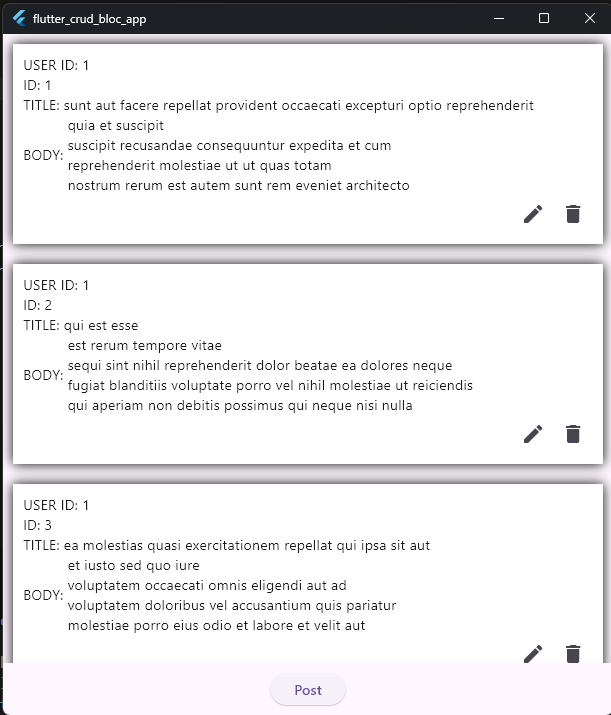

# flutter_crud_bloc_app

Preview:

## Getting Started
This app shows basic API callbacks to Create, Read, Update and Delete posts. It was made using Bloc for business Logic integration to seperate Logic and View making complexity lower.

It contains only two views,
HomeScreen: To view the posts in listview with customized listitem
FormScreen: Where user can update and create nay post

Development Time: ~9 Hour

This was only tested on windows. 