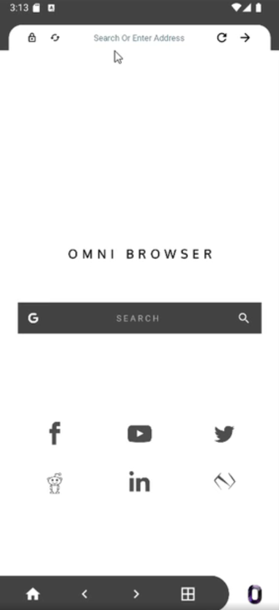

Omni Browser - A lightweight browser for any device

The goal was to create a browser that will only be only made for consumer for only browsing. The modern browsers contains unnecessary features that are not required for normal users but it tooks too much resources. So I wanted to give an attempt to make a browser of my own with only including lightweight features and does not require extra resources and background process.
⭐Features:
1. Obviously a functional browser that takes minimum resource 
2. Search and address bar for quick browsing 
3. Check HTTPS if it is secure with Favicon preview 
5. Homepage, backward, forwar navigation 
6. Multi tab integration [May not work with newer android version]
7. View source of the current page
8. using default Download Manager 
9. Add lock to the browser for privacy 
10. Check history of previous pages 
11. Desktop view by changing user-agent 
and others...
Status : [ DEPRECATED, will work again using different framework]
Tools : Sketchware [converted to Android Studio Project]
Made in around 2019
Development time: less than 2 month